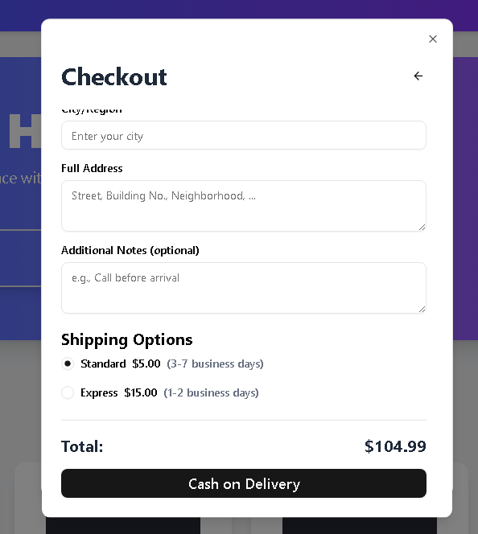

# E-commerce Landing Page with Shopping Cart

This project is a modern and responsive e-commerce landing page built with Next.js, React, and Tailwind CSS. It includes a mock shopping cart and a simple Cash on Delivery (COD) checkout form.

The application aims to demonstrate core front-end development skills, including state management, component architecture, and responsive design.

## Key Features

* **Responsive Landing Page**: A clean and modern user interface that adapts smoothly to all screen sizes (mobile, tablet, and desktop).
* **Dynamic Shopping Cart**: Users can add products to the cart, adjust quantities, and remove items. The cart data is stored locally using `localStorage`.
* **Simplified Checkout Process**: A simple COD checkout form with basic data validation and various shipping options.
* **Order Confirmation**: Upon completing the order, a confirmation screen is displayed with a unique order number and an order summary.
* **Modern UI Components**: Integrated `shadcn/ui` for elegant and accessible UI components, along with `lucide-react` for consistent icons.

## Application Workflow

The following images demonstrate the complete application flow, from adding products to the cart, through the checkout process, to the final order confirmation screen.

  

## Technologies Used

* **Next.js**: A React framework for building fast and efficient web applications.
* **React**: For building the user interface with a component-based architecture.
* **TypeScript**: To ensure code quality and prevent common errors.
* **Tailwind CSS**: A utility-first CSS framework for rapid and responsive styling.
* **shadcn/ui**: A collection of ready-to-use UI components.
* **lucide-react**: An open-source icon library.

## Getting Started

### Prerequisites

* **Node.js**: Make sure you have the latest LTS version of Node.js installed.
* **npm**: Comes bundled with Node.js.

### Installation

1.  **Clone the Repository**:
    ```bash
    git clone <your-repository-url>
    cd <your-project-folder>
    ```
2.  **Install Dependencies**:
    ```bash
    npm install
    ```
3.  **Set up shadcn/ui**:
    If this is a new project, you must initialize `shadcn/ui` and add the components:
    ```bash
    npx shadcn@latest init
    npx shadcn@latest add button dialog form label input radio-group scroll-area textarea
    ```

### Running the Project

To run the server in development mode, use the following command:
```bash
npm run dev